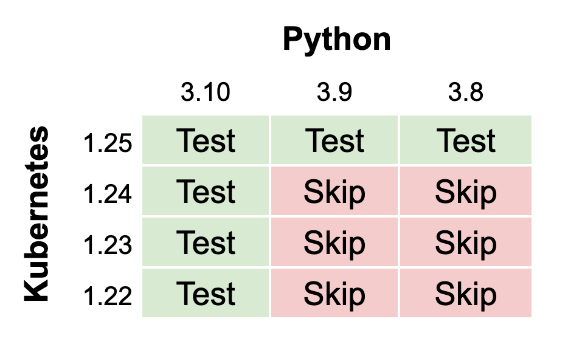

Last week I was on holiday, so I skipped a week of newsletter, and this one is a little light.

## 1. Testing multiple Kubernetes versions in `dask-kubernetes`

Recently [Kubernetes v1.25](https://kubernetes.io/blog/2022/08/23/kubernetes-v1-25-release/) was released which became the default Kubernetes created by `kind`.
In `dask-kubernetes` we use `kind` to create clusters to test against in CI. 
This change in default version caused the `dask-kubernetes` CI to fail unexpectedly.
To resolve this I spent some time this week increasing the test matrix to explicitly test against all Kubernetes versions that we support. Initially I was testing every Python version against every Kubernetes version, which resulted in a lot of uneccesary jobs. Instead we switched things up so that every Python version is tested against the latest Kubernetes, and every Kubernetes is tested against the latest Python. 

```yaml
matrix:
  python-version: ["3.8", "3.9", "3.10"]
  kubernetes-version: ["1.25.0"]
  include:
    - python-version: "3.10"
        kubernetes-version: "1.22.13"
    - python-version: "3.10"
        kubernetes-version: "1.23.10"
    - python-version: "3.10"
        kubernetes-version: "1.24.4"
```

This compromise gives good coverage of all supported versions with out spawning lots of uneccesary jobs.



## 2. Book: Klara and the Sun

While on holiday I read [Klara and the Sun](https://www.goodreads.com/book/show/54120408-klara-and-the-sun). I'm usually an obsessive book reader while on holiday but with two pre-school age kids it's not so easy, so at least I got through one.

It was a great read and kept me wanting to pick it up despite all the interruptions of family life on holiday.

Without spoiling too much it felt like seeing a tiny slice of a rich and interesting world through the eyes of the protagonist Klara. Details were revealed slowly but at enough of a pace to keep you engaged and the story culminated in some though provoking ideas around what it is to be human.


## 3. Self-hosted: Photoprism

I don't like trusting my photos to the various cloud storage solutions like Google Photos, iCloud or Amazon Photos. While they are convenient and useful I don't treat them as permanent places (I lost some photos in 2017 because Apples just empties your iCloud photos if you drop down to zero Apple devices).

My permanent storage is to use [PhotoSync](https://www.photosync-app.com/home.html) to transfer my photos to my NAS and [Photoprism](https://photoprism.app/) to view/archive them. This was I can also include them in my [backup solution](https://duplicacy.com/) too.

It was reassuring to have my holiday photos sync to my NAS at home and be backed up immediately each day.


## 4. Intranet and VPNs

All of my self hosted applications run on my home intranet. Being on holiday this week and able to securely access these really made me appreciate how far my setup has come. When at home and on my private network I can access all of my machines, apps, etc via the `home.jacobtomlinson.dev` subdomain. 

I run [AdGuard Home](https://adguard.com/en/adguard-home/overview.html) which handles DNS level adblocking but also provides my custom home DNS so everything is only accessible on my home network. 

I have a wildcard DNS rule for `*.apps.home.jacobtomlinson.dev` which points to my NAS and I run [NGINX Proxy](https://github.com/nginx-proxy/nginx-proxy) on port `443` with [LetsEncrypt certs](https://letsencrypt.org/) to route traffic to the various Docker containers running on my NAS. So adding a new app is as simple as creating a Docker container with the environment variable `VIRTUAL_HOST` and a value like `foo.apps.home.jacobtomlinson.dev` to access that container's web service on that domain name.

To keep things secure and locked down I don't expose any of this to the internet. Instead I use [Tailscale's wireguard VPN](https://tailscale.com/) running on my [Unifi USG](https://store.ui.com/products/unifi-security-gateway) to connect back home when I am away. Not only does this mean my phone/iPad/laptop can access everything on my network as if I was connected to my WiFi but I can also route all my traffic through my home network so I can access geolocked services like iPlayer while I'm away.
